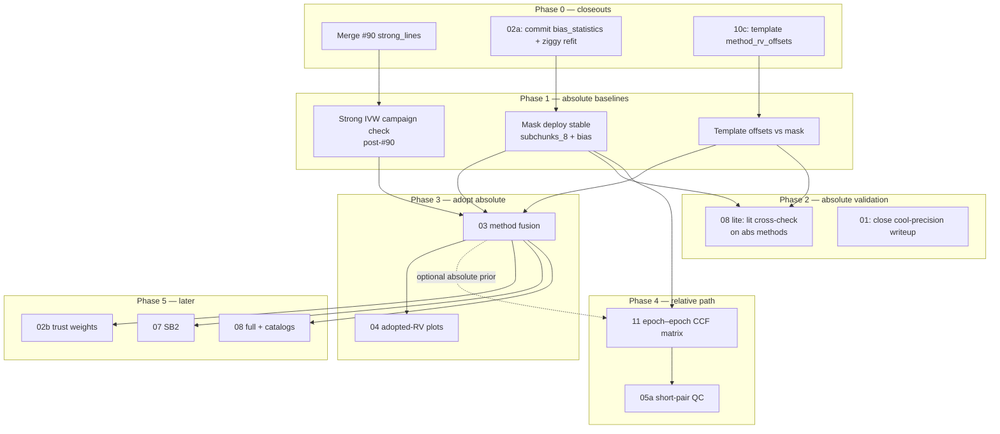

# Order of attack — reliable baselines first

**Date:** 2026-08-01  
**Principle:** Finish absolute-method baselines and open closeouts before fusion polish. Add epoch–epoch CCF as a **relative** RV path that can fill missing absolutes when ≥1 epoch is anchored.

Related: [ORCHESTRATOR.md](ORCHESTRATOR.md) (full subagent launch cards) · [INDEX.md](INDEX.md) · [steps/11-epoch-ccf-matrix.md](steps/11-epoch-ccf-matrix.md) · [WORKFLOW.md](WORKFLOW.md)

---

## North star

1. **Per-method absolute RVs** that are individually trustworthy on the 114-stem / bias-train cohort (mask, template, strong_lines).
2. **Honest fusion** of those absolutes (step 03) with calibrated σ and reject reasons.
3. **Epoch–epoch CCF matrix** (step 11): relative RVs that propagate any absolute anchor across a star’s epochs, and remain scientifically useful as differentials even with zero anchors.

Do **not** retune fusion or trust weights until (1) is closed for each lane that feeds adoption.

---

## Dependency graph (high level)

---

## Phase 0 — Finish open tasks (serial blockers + wait)

| Priority | Task | Owner style | Notes |
|----------|------|-------------|-------|
| 0a | ~~Wait for CI → merge [#90](https://github.com/UCSC-Transients/dark-hunter_rv/pull/90)~~ | **DONE** 2026-08-02 | Step 06 complete; #43/#91–#93 closed |
| 0b | ~~Land ORCHESTRATOR / ATTACK_ORDER / step 11 docs on main~~ | **DONE** | [#95](https://github.com/UCSC-Transients/dark-hunter_rv/pull/95) / [#101](https://github.com/UCSC-Transients/dark-hunter_rv/pull/101) |
| 0c | **02a closeout:** rebuild/commit `bias_statistics.txt` for `subchunks_8`; ziggy catalog refit | **DEFERRED** pre-final | Jun-16 table kept; ziggy human-gated |
| 0d | ~~**10c:** `method_rv_offsets.txt` (mask as truth) + ops note~~ | **DONE** | On main via #95/#101 |

**Phases 1–5 code:** landed on `main` as `c6801f7` ([#101](https://github.com/UCSC-Transients/dark-hunter_rv/pull/101)). Remaining: soft residuals + pre-final bias/ziggy.

---

## Phase 1 — Reliable absolute baselines (max parallel)

Goal: each absolute method has a frozen recipe + cohort metrics vs mask (or lit).

### Lane A — mask_ccf (baseline of baselines)

- Confirm production stack: `subchunks_8` + committed bias + `gauss_offset` (09 done).
- Close remaining step **01** documentation / Phase A gate summary if still open.
- **Defer 02b** trust weights until after Phase 3 fusion (per step 02 plan).

### Lane B — template_fft

- Finish **10c** offsets; publish mask−template residual table on 114 (already have #88 confirm MAD ~0.9 km/s).
- Mark step 10 `complete` when offsets committed and playbook updated.

### Lane C — strong_lines

- Post-merge: spot-check `qc_reason=ivw_n=…` on a few spectra; optional 114 re-run or overlap residual vs mask for IVW product (not blocking fusion if unit tests + file Q are in).
- Document Q table and inclusion in `docs/broad_line_method.md` (mostly done on #90).

### Parallel subagent map (Phase 1)

| Subagent | Scope | Must not touch |
|----------|--------|----------------|
| **A — mask deploy** | `rebuild_mask_bias`, `bias_statistics.txt`, `mask_lane_deploy.md`, ziggy refit notes | template offsets, strong_lines |
| **B — template offsets** | `compute_method_rv_offsets`, `method_rv_offsets.txt`, step 10c checkboxes | bias_statistics rebuild |
| **C — strong post-merge QA** | overlap/diagnostics spot-check, step 06 INDEX → complete | fusion policy |
| **D — step 11 design spike** | API sketch + synthetic matrix LS tests (no pipeline default) | production adoption |

A/B/C are independent once #90 is merged and bias rebuild does not collide with offset file writers. **D can start immediately** (even while CI runs) — relative path does not need fusion.

---

## Phase 2 — Absolute validation (parallel with late Phase 1)

| Task | Why now | Parallel? |
|------|---------|-----------|
| **08 lite** | Lit master (00) exists; compare **mask** and **template** (and strong when ready) to El-Badry without waiting for SB2 | Yes — soft-dep: drop hard `depends_on: 07` for lite path |
| **01 closeout** | Write cool-precision north-star numbers against deployed mask | Parallel with 08 lite |
| Short smoke multi-epoch stars | Ensure summaries have finite abs RVs before matrix work | With D |

Do **not** wait for step 07 (SB2) to start external absolute checks.

---

## Phase 3 — Fusion of absolute methods

Only after Phase 1 lanes that feed adoption are “good enough”:

1. **Step 03** — `method_fusion.py`: bias surfaces, σ inflation, discordance gates, coverage tables.
2. **Step 04** — adopted-RV match plots (needs fused/adopted RV).

**Subagents:** implementation of 03 (core) then 04 (plots) — mostly serial; plot scaffolding can start once fusion column schema is fixed.

---

## Phase 4 — Epoch–epoch CCF matrix (new absolute-relative hybrid)

Full design: [steps/11-epoch-ccf-matrix.md](steps/11-epoch-ccf-matrix.md).

**Science ask (user):**

- Cross-correlate **all epochs × all epochs**, plus **auto-correlation** on the diagonal.
- Output: matrix of relative RVs \(\Delta v_{ij}\) and errors.
- Combine with vector of measured **absolute** RVs \(A_i\) (possibly sparse) to solve for best absolute (or fill missing).
- If **no** absolute exists, relative matrix remains useful (orbit shape / activity / SB2 hints).

**Relation to old step 05:**

- **05a** short-pair calibration stays **QC** (Δt≈0 pairs).
- **05b** “consistency only” is **superseded / absorbed** by step 11 as a **measurement path**, not merely a monitor.
- Step 05 `depends_on: 04` and `blocks: 06` are outdated; 05a can run after multi-epoch abs RVs exist (Phase 1+).

**When to start coding:** Phase 1 **subagent D** (design + synthetic LS).  
**When to wire into pipeline defaults:** after Phase 3 has an absolute prior to seed, or earlier as opt-in `epoch_ccf` method row.

**Parallelism:** heavy CCF matrix computation is embarrassingly parallel over pairs \((i,j)\) with \(i \le j\); one subagent for estimator + one for GLS combiner + one for validation CLI.

---

## Phase 5 — Deferred (after baselines + fusion + matrix v1)

| Step | Reason to wait |
|------|----------------|
| **02b** trust weights | Avoid retuning mask stack twice; needs stable abs + fusion metrics |
| **07** SB2 | Needs clean single-star abs/rel residuals to define “anomaly” |
| **08 full** | Catalogs + orbit overlays after adopted RV stable |
| **05a** polish | Natural validation of step 11 on Δt≈0 pairs |

---

## Recommended next actions (this week)

1. **Human:** merge #90 when CI green; mark step 06 complete in INDEX.
2. **Parallel subagents:**
   - Mask bias commit + deploy checklist (02a).
   - Template `method_rv_offsets` (10c).
   - Step 11 plan → issue + synthetic least-squares prototype.
3. **Serial follow-up:** 114 (or bias-train) overlap snapshot with all three abs methods → freeze “baseline RV” CSV for fusion.
4. **Then:** step 03 fusion; step 11 matrix on multi-epoch stars.

---

## What “reliable baseline RV” means (exit criteria)

Per exposure / per star, before calling fusion “done”:

| Method | Finite | Calibrated | Sanity |
|--------|--------|------------|--------|
| mask_ccf | chunk IVW + bias | σ from stack | Phase A / cool benchmark |
| template_fft | bank + vsini path | offset vs mask (10c) | mask−template MAD ≲ few km/s on cool cohort |
| strong_lines | ≥1 included line | file offset + Q×SNR² | inclusion QC; Hβ-primary Balmer |
| epoch_ccf (11) | relative matrix | abs fill when anchors exist | auto-corr peak QC; short-pair Δ≈0 |

---

## Anti-goals (do not prioritize yet)

- Retuning continuum `split` / blaze (frozen).
- Mask retile beyond `subchunks_8`.
- ML fusion scorer.
- Making epoch CCF the **only** absolute zeropoint (it is relative-first).
