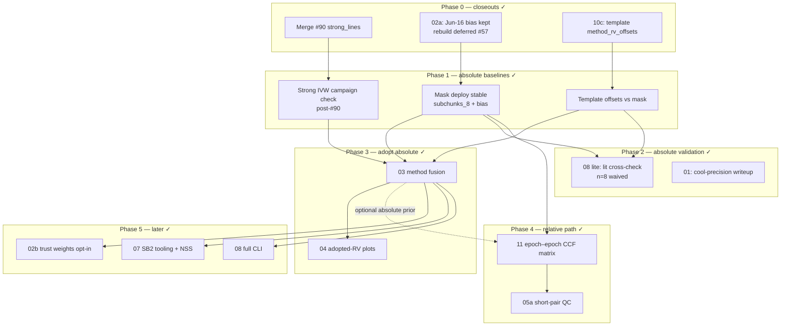

# Order of attack — reliable baselines first

**Date:** 2026-08-02  
**Status:** Phases 0–5 **complete** on `main` (through [#101](https://github.com/UCSC-Transients/dark-hunter_rv/pull/101) + soft residuals [#103](https://github.com/UCSC-Transients/dark-hunter_rv/pull/103)–[#106](https://github.com/UCSC-Transients/dark-hunter_rv/pull/106)). Gate defaults: [HUMAN_GATES.md](HUMAN_GATES.md).  
**Principle (historical):** Finish absolute-method baselines and open closeouts before fusion polish. Add epoch–epoch CCF as a **relative** RV path that can fill missing absolutes when ≥1 epoch is anchored.

Related: [ORCHESTRATOR.md](ORCHESTRATOR.md) · [INDEX.md](INDEX.md) · [HUMAN_GATES.md](HUMAN_GATES.md) · [steps/11-epoch-ccf-matrix.md](steps/11-epoch-ccf-matrix.md) · [WORKFLOW.md](WORKFLOW.md)

---

## North star

1. **Per-method absolute RVs** that are individually trustworthy on the 114-stem / bias-train cohort (mask, template, strong_lines). → **done**
2. **Honest fusion** of those absolutes (step 03) with calibrated σ and reject reasons. → **done**
3. **Epoch–epoch CCF matrix** (step 11): relative RVs that propagate any absolute anchor across a star’s epochs. → **done** (opt-in enrich; default adopt declined)

**Open residual (not a phase relaunch):** pre-final `bias_statistics.txt` rebuild + ziggy catalog refit when human says go ([#57](https://github.com/UCSC-Transients/dark-hunter_rv/issues/57)).

---

## Dependency graph (high level)

---

## Phase status (post-gates)

| Phase | Outcome |
|-------|---------|
| 0 | #90 merged; 10c offsets on main; **bias rebuild still deferred** (#57) |
| 1 | mask / template / strong baselines on main (#95) |
| 2 | 01 waivers + 08 lite (#96 → #101); lit n=8 waived (#104/#106) |
| 3 | fusion + adopted plots (#97 → #101) |
| 4 | epoch CCF matrix + 05a (#98 → #101); 11d enrich (#103); no default adopt |
| 5 | trust opt-in; SB2 fuse + NSS 147/155; 08-full CLI (#99 → #105) |

---

## Recommended next actions

1. Merge docs closeout [#107](https://github.com/UCSC-Transients/dark-hunter_rv/pull/107) if still open.
2. **Human:** say go for bias rebuild + ziggy (`bash scripts/rebuild_mask_bias.sh` then ziggy refit) — see `calibration/mask_lane_deploy.md`.
3. Optional: full `output/` SB2 refit for flag rates; ingest more El-Badry spectra if n≥10 lit wanted.
4. Non-orchestrator lanes when ready: [#81](https://github.com/UCSC-Transients/dark-hunter_rv/issues/81) telluric ZP, [#82](https://github.com/UCSC-Transients/dark-hunter_rv/issues/82) instruments, website #73/#75.

---

## What “reliable baseline RV” means (exit criteria)

Per exposure / per star, before calling fusion “done”:

| Method | Finite | Calibrated | Sanity |
|--------|--------|------------|--------|
| mask_ccf | chunk IVW + bias | σ from stack | Phase A / cool benchmark |
| template_fft | bank + vsini path | offset vs mask (10c) | mask−template MAD ≲ few km/s on cool cohort |
| strong_lines | ≥1 included line | file offset + Q×SNR² | inclusion QC; Hβ-primary Balmer |
| epoch_ccf (11) | relative matrix | abs fill when anchors exist | auto-corr peak QC; short-pair Δ≈0 |

---

## Anti-goals (still frozen)

- Retuning continuum `split` / blaze (frozen).
- Mask retile beyond `subchunks_8`.
- ML fusion scorer.
- Making epoch CCF the **only** absolute zeropoint (it is relative-first).
- Flipping trust or epoch_ccf to **defaults** without reopening HUMAN_GATES.
