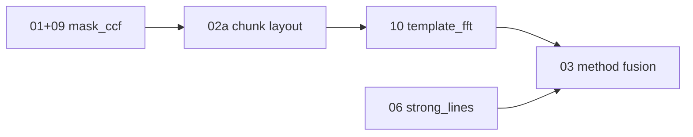

# Step 01: Benchmark cool high-S/N mask precision

## Goal / science outcome

Quantify APF **mask_ccf** per-epoch precision on cool, high-S/N calibration spectra and document gap to **<0.1 km/s** target. This step closes the **mask lane** of the per-method precision program; **template_fft** (step 10) and **strong_lines** (step 06) are separate lanes with their own tuning.

## Strategy: per-method lanes before fusion



Do **not** tune adopted-RV cascade (step 03) until each measurement path has its own baseline and deploy config.

## Scope (in) / non-goals (out)

**In:** Repeatability / chunk-scatter metrics on bias-training or overlap cool-star set; Phase A overlap gates; mask campaign north-star σ_RV.

**Out:** Template FFT tuning (step 10); trust weights (step 02b); method fusion (step 03).

## Prerequisites

- Calibration list (`calibration/bias_train.txt` or equivalent)
- Pipeline run with bias on, `--run-all-methods`
- Chunk campaign under `validation_output/chunk_campaign/` (114 exposures)

## Implementation tasks

### Core benchmark (step 01)

- [x] Define metric: per-exposure chunk scatter (initial); night-pair / jackknife deferred
- [x] `validation/benchmark_cool_precision.py` for cool-star high-S/N subset
- [x] Phase A: `validation/rv_phase_a_baseline.py` — overlap inventory, absolute (APF–lit) and relative (APF–APF) gates
- [x] Frozen baseline: `calibration/phase_a_baseline/` (goals.yaml, reference_manifest.json)
- [x] Produce `validation_output/benchmark_cool_precision/` tables + plots (RMS vs log10 mask CCF S/N)
  - Primary path: `/Users/rfoley/darkhunter/rvs/dark-hunter_rv/validation_output/benchmark_cool_precision/` (s8 campaign diags; **n_high_snr=0**)
  - Production path: `.../validation_output/benchmark_cool_precision_production/` (n_high_snr=2)
- [x] Document 0.1 km/s goal interpretation (single epoch vs night-mean) in playbook
- [x] Record final mask-lane numbers in this file after `subchunks_8` deploy (see Closeout below)
- [ ] `--no-bias` pipeline rerun on overlap stars for canonical absolute gate — **WAIVED / deferred** (0 APF–lit pairs in 7 d window; absolute gate N/A until epoch coverage improves)

### Mask lane closure (extends 01 + 02a + 09)

- [x] Chunk campaign: uniform `subchunks_8` beats `subchunks_4` (~15% lower median σ_RV on 114-file cohort; adaptive mix ≈ pure s8)
- [x] CCF estimator: `gauss_offset` adopted (step 09)
- [x] Per-order heterogeneous mixes ruled out (greedy σ_norm mix worse than uniform layouts)
- [x] N ∈ {5,6,7,>8} not pursued — s8 sufficient on campaign
- [x] **Deploy defaults:** `DEFAULT_CHUNK_LAYOUT` → `subchunks_8.yaml`; refit scripts updated
- [x] `calibration/bias_train.txt` (114 campaign spectra)
- [x] `scripts/rebuild_mask_bias.sh` + `run_calibration_setup --chunk-layout`
- [ ] Run `bash scripts/rebuild_mask_bias.sh` → commit new `bias_statistics.txt` — **WAIVED for step 01** (MASK-DEPLOY / P0c: keep Jun-16 s8 `bias_statistics.txt`, 364 chunk keys; fresh rebuild deferred pre-final)
- [ ] Refit production catalog (local + ziggy) — **deferred** with bias rebuild

## Key files

- `validation/benchmark_cool_precision.py`, `validation/rv_phase_a_baseline.py`
- `validation/chunk_campaign.py`, `validation/chunk_adaptive_stack.py`
- `validation/chunk_optimization_advice.md`
- `validation/rv_method_diagnostics_report.py`, `validation/rv_method_overlap_report.py`
- `darkhunter_rv/pipeline.py`, `darkhunter_rv/ccf_rv_estimators.py`

## Commands

```bash
cd /Users/rfoley/darkhunter/rvs/dark-hunter_rv
CAMPAIGN=validation_output/chunk_campaign

# Cool-star internal benchmark
PYTHONPATH=. python3 -m validation.benchmark_cool_precision \
  --diagnostics-glob 'output/Gaia_DR3_*_diagnostics.csv' \
  --out-dir validation_output/benchmark_cool_precision

# Phase A gates (overlap inventory + APF–lit / APF–APF)
PYTHONPATH=. python3 -m validation.rv_phase_a_baseline \
  --output-dir output \
  --out-dir validation_output/rv_phase_a_baseline

# Mask lane campaign summary (post subchunks_8)
PYTHONPATH=. python3 -m validation.chunk_adaptive_stack --campaign-dir "$CAMPAIGN"
```

## Acceptance criteria

- Report identifies median/p90 chunk scatter for cool stars with `log10(median_mask_ccf_peak_snr) > 1.0`
- Explicit statement: met / not met / how far from 0.1 km/s goal
- Phase A overlap list + gate reports under `validation_output/rv_phase_a_baseline/`
- Mask lane deploy checklist complete (layout + bias + refit) **or** documented blocker
- Handoff note to step 10 (template baseline commands run on same diagnostics glob)

### Phase A baseline (2026-06-07, bias applied, subchunks_4 era)

| Metric | Value |
|--------|-------|
| Overlap stars (APF ∩ literature) | 8 |
| APF–literature pairs (7 d window) | 0 (min separation 189–971 d) |
| APF–APF pairs (7 d) | 14 across 4 stars |
| Relative gate median \|ΔRV\| | 0.30 km/s |
| Relative gate p90 \|ΔRV\| | 16.3 km/s (outliers: Gaia BH1, J1449+6919) |
| Stars with good relative precision | J2102+3703 (~0.009 km/s), J0824+5254 (~0.30 km/s) |

### Chunk campaign (2026-06, 114 exposures, production stack metric)

| Layout | Median σ_RV | Notes |
|--------|-------------|-------|
| **subchunks_8** | **0.0189 km/s** | Recommended production layout |
| subchunks_4 | 0.0223 km/s | Prior production |
| adaptive_mix | 0.0189 km/s | Collapses to s8 on 110/114 exposures |

**Caveat:** s8 improves per-epoch σ_RV but had worse APF–APF relative gate than s4 in campaign — review before binaries-heavy science.

## Tests / validation

- `tests/validation/test_benchmark_cool_precision.py`
- Chunk campaign tests: `test_chunk_adaptive_stack`, `test_per_order_chunk_baseline`, `test_spectrum_tiling_search`
- Step 09: `tests/test_ccf_rv_estimators.py`, `tests/validation/test_ccf_rv_post_debias.py`

## Propagation checklist (on merge)

- [x] Master todo `benchmark-cool-precision` → completed (mask lane + closeout; bias rebuild waived)
- [ ] INDEX.md status + issue #38 closed (orchestrator / human; this card does not edit INDEX)
- [x] Begin step 10 on fresh branch after mask deploy snapshot (handoff note below; step 10 already active elsewhere)

## Open decisions

- **0.1 km/s:** track both single-epoch σ_RV and night-pair / APF–APF relative gate (precision framework Phase A).
- **Cool high-S/N cut:** `log10(median_mask_ccf_peak_snr) > 1.0` + mask-applicable Teff (`method_regions`).
- **Production layout:** uniform `subchunks_8` (not per-order greedy mix).


## Closeout (BENCH-01, 2026-08-01) — verdict: **COMPLETE with waivers**

Synthesized from existing campaign / Phase A / MASK-DEPLOY artifacts. **No bias rebuild. No ziggy. No full re-campaign.**

### 0.1 km/s goal interpretation

| Metric | Meaning | Target |
|--------|---------|--------|
| **Single-epoch σ_RV** | Calibrated mask stack uncertainty after per-chunk debias + IVW (`median_sigma_rv_kms`) | **< 0.1 km/s** (north star) |
| **APF–APF relative gate** | Night-pair \|ΔRV\| within 7 d (Phase A) | median → 0.1 km/s |
| **Chunk scatter** | Raw per-exposure std of chunk RVs (pre-stack) | Diagnostic only; typically ≫ σ_RV |

Night-mean / jackknife deferred (open decisions). Playbook: `docs/validation_playbook.md` (Cool high-S/N + goal note).

### Mask lane final numbers (`subchunks_8` + Jun-16 bias)

Source: `validation_output/chunk_campaign/adaptive_stack_comparison.csv` (114 common exposures).

| Layout | Median σ_RV | p90 σ_RV | Rel. median \|ΔRV\| (9 pairs) |
|--------|------------:|---------:|------------------------------:|
| **subchunks_8** | **0.0189 km/s** | **0.0283 km/s** | 0.708 km/s |
| subchunks_4 | 0.0223 km/s | 0.0300 km/s | 0.313 km/s |
| adaptive_mix | 0.0189 km/s | 0.0283 km/s | 0.499 km/s (≈ s8 on 110/114) |

- **Single-epoch σ_RV vs 0.1 km/s: MET** (median ~5.3× below; p90 also below).
- Deploy: `DEFAULT_CHUNK_LAYOUT` → `subchunks_8.yaml`; CCF estimator `gauss_offset`; bias `bias_statistics.txt` @ `a312993` (2026-06-16), 364 keys (`0`–`7` suffixes). See `calibration/mask_lane_deploy.md`.

### Cool high-S/N chunk-scatter report

CLI: `python -m validation.benchmark_cool_precision`.

| Set | n cool mask-app | n log10(SNR)≥1 | median scatter | p90 scatter | median < 0.1? |
|-----|----------------:|---------------:|---------------:|------------:|:-------------:|
| s8 campaign diags | 41 | **0** (max log10≈0.86) | — | — | n/a (empty cut) |
| production `output/` | 43 | **2** | **0.707 km/s** | **1.027 km/s** | **NOT MET** |

Cool mask-applicable cohort (production, no log10 cut): median chunk scatter ≈ 0.65 km/s; **0%** below 0.1. Chunk scatter is **not** the epoch-precision metric — σ_RV is.

### Phase A gate summary (frozen 2026-06-07, bias on; s4-era summaries)

Path: `/Users/rfoley/darkhunter/rvs/dark-hunter_rv/validation_output/rv_phase_a_baseline/`

| Gate | Result |
|------|--------|
| Overlap stars | 8 |
| APF–lit pairs (7 d) | **0** (min sep 189–971 d) → absolute gate **N/A** |
| APF–APF pairs (7 d) | 14 / 4 stars |
| Rel. median \|ΔRV\| | **0.303 km/s** — **NOT MET** vs 0.1 |
| Rel. p90 \|ΔRV\| | 16.3 km/s (outliers: Gaia BH1, J1449+6919) |
| Good relative stars | J2102+3703 ~0.009; J0824+5254 ~0.30 |

s8 campaign relative gate (9 pairs) **worse** than s4 on this small pair set — caveat retained for binaries-heavy science.

### Acceptance checklist

- [x] Report median/p90 chunk scatter for cool + log10(SNR)>1 (production: 0.707 / 1.027, n=2; campaign cut empty)
- [x] Explicit vs 0.1: **σ_RV MET**; **chunk-scatter NOT MET** (diagnostic); **Phase A relative NOT MET**; absolute N/A
- [x] Phase A reports present under `validation_output/rv_phase_a_baseline/`
- [x] Mask deploy checklist complete **with documented waiver** (bias rebuild + catalog refit deferred; Jun-16 s8 bias kept)
- [x] Handoff → step 10: same cool/campaign diagnostics globs; mask baseline locked at s8 + current bias

### Waivers (what would fully clear without waive)

1. Fresh `bash scripts/rebuild_mask_bias.sh` + commit + local/ziggy refit (pre-final product).
2. `--no-bias` overlap rerun when APF–lit pairs exist in window (canonical absolute gate).
3. Optional: night-pair / jackknife on high-S/N cool subset once more log10(SNR)≥1 epochs exist.

### Handoff to step 10 (template FFT)

```bash
cd /Users/rfoley/darkhunter/rvs/dark-hunter_rv
# Mask baseline already in campaign / production diagnostics; template lane uses same globs:
PYTHONPATH=. python -m validation.rv_method_overlap_report \
  --diagnostics-glob 'output/Gaia_DR3_*_diagnostics.csv' \
  --out-dir validation_output/template_fft_baseline
# Or continue from existing template_fft_baseline / FULL_COMPARISON under validation_output/
```


## Next step

**Step 10 — template FFT precision:** baseline mask−template overlap, then tune template-specific knobs. See [10-template-fft-precision.md](10-template-fft-precision.md).
